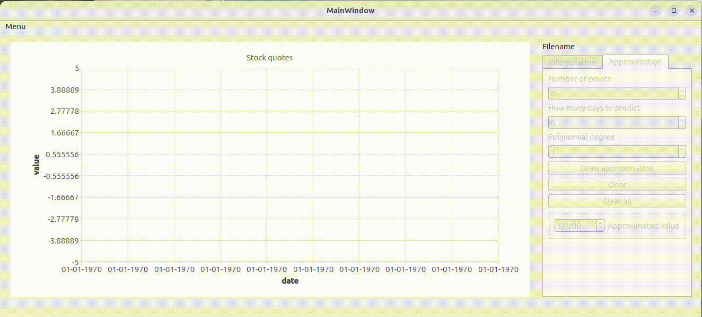

# AlgorithmicTrading

Программа написана на C++ и предназначена для построения таблично заданных
функций, а так же последующей аппроксимации и интерполяции таблично заданных
данных.

##  Зависимости
* gcc с поддержкой C++17
* qt5 или qt6 (Widgets, Charts, Core)
* cmake

## Сборка
```
cd src
mkdir build
cmake -S . -B ./build
cmake --build ./build
cp ./build/A8_Algorithmic_trading ./algorithmic_trading
```

## Использование
пример входных данных можно найти в папке materials


